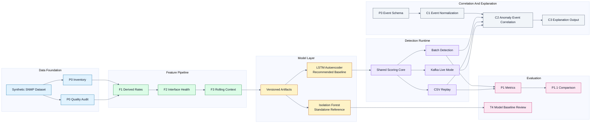
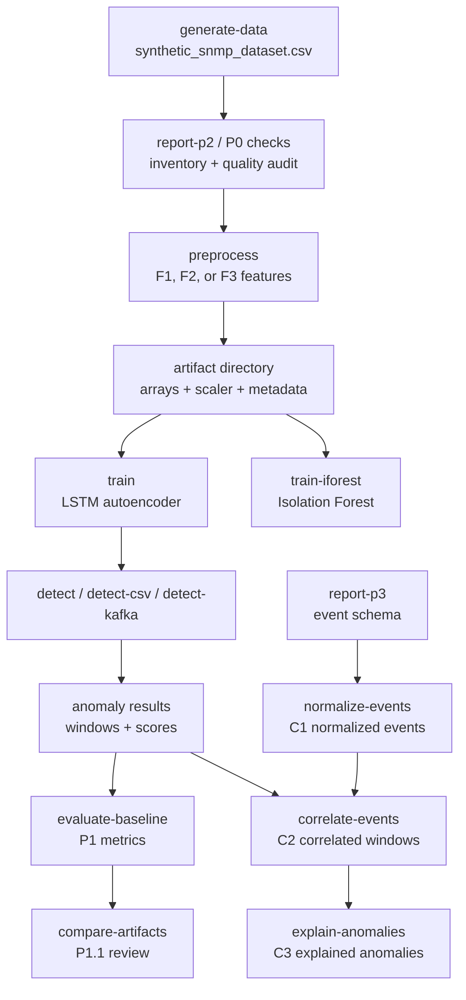

# SNMP Anomaly Detection Architecture Achieved So Far

## Purpose

This document explains the architecture currently achieved in the SNMP anomaly detection project. It covers:

- the complete pipeline architecture
- the scope of each implemented stage
- current recommended artifacts
- restrictions and limitations
- practical solutions for each restriction
- what should be treated as production-ready, experimental, or future work

## Executive Summary

The project has evolved from a synthetic dataset generator into an end-to-end SNMP anomaly detection and explanation pipeline.

Current achieved capabilities:

- synthetic SNMP-like dataset generation
- dataset inventory and quality audit
- per-interface derived-rate feature engineering
- richer interface health and capacity features
- contextual rolling features
- LSTM autoencoder anomaly detection
- Isolation Forest standalone baseline experiment
- repeatable artifact-based training and evaluation
- artifact-to-artifact comparison reporting
- CSV replay detection
- Kafka-oriented live detection entry points
- normalized event ingestion for SNMP trap / interface-state events
- deterministic anomaly-to-event correlation
- deterministic explanation generation

Current recommended artifact strategy:

- official rich-feature baseline: `f3_t3_seq10_p995_v1`
- stable simple baseline: `f1_baseline_v1`
- low-noise rich-feature option: `f3_t3_seq10_p999_v1`
- standalone Isolation Forest reference: `iforest_f3_v1`

The recommended production direction is `per-interface` anomaly detection. `per-device` remains a fallback only when interface telemetry is missing.

## Presentation Architecture Diagram



## Detailed Execution Flow



## Recommended Presentation Callout

Use this one-line summary beside the diagram:

```text
The system converts SNMP counters into per-interface behavioral windows, scores them with a versioned anomaly model, then correlates anomalous windows with normalized operational events to produce explainable anomaly evidence.
```

## Current Data Architecture

### Dataset Scope

The current dataset is synthetic and SNMP-like. It is stored at:

```text
snmp_anomaly_detection/data/synthetic_snmp_dataset.csv
```

Current inventory:

| Area | Current Value |
| --- | ---: |
| Rows | `30000` |
| Columns | `20` |
| Devices | `15` |
| Interfaces | `4` |
| Timeline start | `2025-01-01 00:00:00` |
| Timeline end | `2025-01-07 22:35:00` |
| Per-interface ready devices | `15` |
| Per-device fallback devices | `0` |

Current dataset columns include:

- identity: `timestamp`, `device_id`, `vendor`, `device_type`, `interface`
- resource usage: `cpu`, `memory`
- cumulative counters: `in_octets`, `out_octets`, `errors`
- packet counters: `in_ucast_pkts`, `out_ucast_pkts`
- discard counters: `in_discards`, `out_discards`
- interface context: `interface_speed_mbps`, `interface_admin_status`, `interface_oper_status`
- labels and metadata: `anomaly`, `anomaly_type`, `counter_reset`

### Data Quality Scope

Implemented checks:

- duplicate rows
- duplicate natural keys
- timestamp parsing failures
- out-of-order groups
- polling gaps
- irregular intervals
- missing required values
- negative counter deltas

Current quality result:

| Check | Current Result |
| --- | ---: |
| Duplicate rows | `0` |
| Duplicate keys | `0` |
| Timestamp parse failures | `0` |
| Out-of-order groups | `0` |
| Groups with polling gaps | `0` |
| Negative counter deltas | `0` |

## Feature Architecture

### `F1`: Derived-Rate Baseline Scope

Purpose:

- convert cumulative SNMP counters into rate-based model features
- make model input closer to real SNMP behavior

Implemented features:

- `in_rate`
- `out_rate`
- `error_rate`
- existing device metrics: `cpu`, `memory`

Important implementation rules:

- rates are calculated per `device_id + interface`
- elapsed poll time is used
- reset-aware logic avoids false spikes from counter resets
- offline preprocessing, CSV replay, and Kafka live scoring share the same core rate behavior

Stable simple baseline artifact:

```text
f1_baseline_v1
```

### `F2`: Extended Interface Feature Scope

Purpose:

- add capacity and interface-health context
- help distinguish traffic spikes, congestion, packet loss, and interface state changes

Implemented feature areas:

- utilization:
  `utilization_in_pct`, `utilization_out_pct`
- discards:
  `discard_rate_in`, `discard_rate_out`
- packet rates:
  `packet_rate_in`, `packet_rate_out`
- directional balance:
  `in_out_ratio`
- interface state:
  `interface_oper_status`, `interface_admin_status`

First reviewed artifact:

```text
f2_candidate_v1
```

Current decision:

- do not promote raw `F2` over `f1_baseline_v1`
- keep `F2` as the foundation for richer contextual `F3` features

### `F3`: Contextual Rolling Feature Scope

Purpose:

- tell the model whether current behavior is unusual for that same interface stream
- add rolling context to traffic, error, and utilization signals

Implemented contextual features for:

- `in_rate`
- `out_rate`
- `error_rate`
- `utilization_in_pct`
- `utilization_out_pct`

For each base signal:

- rolling mean
- rolling standard deviation
- z-score
- trend

Additional feature:

- `burst_indicator`

Official rich-feature baseline:

```text
f3_t3_seq10_p995_v1
```

Feature count:

```text
35
```

Current decision:

- promote `f3_t3_seq10_p995_v1` as the recommended rich-feature baseline
- keep `f3_t3_seq10_p999_v1` as the stricter low-noise option

## Model Architecture

### LSTM Autoencoder Scope

Primary model:

```text
LSTM autoencoder
```

Responsibility:

- learn normal sequence behavior
- reconstruct input windows
- calculate reconstruction error
- flag windows whose reconstruction error exceeds the selected threshold

Current recommended configuration:

| Setting | Value |
| --- | --- |
| Artifact | `f3_t3_seq10_p995_v1` |
| Feature profile | `F3` |
| Feature count | `35` |
| Sequence length | `10` |
| Threshold mode | percentile |
| Threshold percentile | `99.5` |

Current rich-feature performance:

| Artifact | Precision | Recall | False Positive Rate | False Positives | True Positives |
| --- | ---: | ---: | ---: | ---: | ---: |
| `f3_t3_seq10_p995_v1` | `0.1002` | `0.6570` | `0.0553` | `1634` | `182` |

Compared with `f1_baseline_v1`:

- true positives increased by `14`
- false positives decreased by `19`
- precision improved
- recall improved
- false positive rate improved

### Isolation Forest Scope

Secondary model:

```text
Isolation Forest
```

Responsibility:

- provide a standalone non-sequential model baseline
- support T4 comparison work
- not replace the LSTM rich-feature baseline yet

Current decision:

- keep `iforest_f3_v1` as a completed standalone experiment
- do not promote it over `f3_t3_seq10_p995_v1`
- do not build an ensemble until Isolation Forest tuning proves complementary value

## Artifact Architecture

Artifacts are versioned under:

```text
snmp_anomaly_detection/artifacts/<artifact_dir_name>/
```

Typical LSTM artifact contents:

- `X_train.npy`
- `X_test.npy`
- `y_train.npy`
- `y_test.npy`
- `scaler.pkl`
- `lstm_autoencoder.pth`
- `model_metadata.json`
- `preprocessing_metadata.json`

Typical Isolation Forest artifact contents:

- `isolation_forest.pkl`
- `isolation_forest_metadata.json`

Artifact rule:

- use the same artifact directory name for preprocessing, training, detection, and evaluation when they belong to the same experiment

Important current artifacts:

| Artifact | Role |
| --- | --- |
| `f1_baseline_v1` | stable simple baseline |
| `f3_t3_seq10_p995_v1` | official recommended rich-feature baseline |
| `f3_t3_seq10_p999_v1` | lower-noise rich-feature option |
| `iforest_f3_v1` | standalone Isolation Forest reference |

## Inference Architecture

### Shared Core Scope

The inference core separates model loading, scaler loading, and scoring logic from input sources.

Implemented shared responsibilities:

- load saved model artifacts
- load saved scaler artifacts
- load model metadata and threshold
- scale windows
- score one window or a batch of windows
- calculate reconstruction error
- identify anomaly flag
- identify top contributing feature and timestep

This allows the same model-scoring path to support:

- batch detection
- CSV replay
- Kafka live mode

### CSV Replay Scope

Purpose:

- replay historical CSV rows as normalized events
- use the same event processor intended for live Kafka flow
- produce deterministic local outputs

Outputs:

- `snmp_anomaly_detection/outputs/anomaly_results.csv`
- `snmp_anomaly_detection/outputs/anomaly_windows.json`

### Kafka Live Scope

Purpose:

- consume JSON events from Kafka
- normalize them into the same event structure
- pass them through the same event processor and rolling window manager
- produce local JSONL result outputs

Implemented live commands:

- `detect-kafka-dry`
- `detect-kafka`
- `produce-kafka-test-data`

Kafka v1 output files:

- `snmp_anomaly_detection/outputs/kafka_live_results.jsonl`
- `snmp_anomaly_detection/outputs/kafka_live_anomaly_windows.jsonl`

Current live-mode boundary:

- local result output is implemented
- output Kafka topics are not implemented yet
- dynamic topic switching is not implemented yet

## Evaluation Architecture

### `P1`: Baseline Evaluation Scope

Purpose:

- make model evaluation repeatable
- save time-split definitions
- save baseline metrics

Outputs:

- `<artifact>_p1_time_split.json`
- `<artifact>_p1_baseline_metrics.json`

### `P1.1`: Artifact Comparison Scope

Purpose:

- compare candidate artifacts against a baseline
- make experiment promotion decisions repeatable

Implemented comparison categories:

- baseline versus T1 candidates
- baseline versus T2 candidates
- baseline versus F2 candidates
- baseline versus F3 candidates
- baseline versus threshold-tuned F3/T3 candidates

Current recommendation:

- `f3_t3_seq10_p995_v1` is the recommended rich-feature baseline
- `f1_baseline_v1` remains the stable simple comparison baseline

## Event Correlation And Explanation Architecture

### `P3`: Event Source Readiness Scope

Purpose:

- choose the first operational event source for correlation
- define normalized event schema
- document timestamp alignment policy
- generate sample normalized events

Current selected event source:

- SNMP traps / interface-state events

P3 outputs:

- `p3_event_source_selection.json`
- `p3_normalized_event_schema.json`
- `p3_timestamp_alignment_notes.json`
- `p3_sample_normalized_events.jsonl`

### `C1`: Event Normalization Scope

Purpose:

- normalize raw or semi-normalized event rows into the shared P3 schema
- emit accepted and rejected records
- preserve deterministic mapping rules

Accepted input formats:

- CSV
- JSON
- JSONL

Current C1 summary:

| Metric | Value |
| --- | ---: |
| Input rows | `100` |
| Normalized events | `100` |
| Rejected events | `0` |
| `high_error_rate` events | `50` |
| `interface_down` events | `25` |
| `interface_up` events | `25` |

Outputs:

- `c1_normalized_events.jsonl`
- `c1_rejected_events.jsonl`
- `c1_normalization_summary.json`

### `C2`: Anomaly/Event Correlation Scope

Purpose:

- match anomaly windows with nearby normalized events
- use deterministic key, time, severity, feature, and proximity scoring

Correlation policy:

- anchor: anomaly `window_end`
- lookback: `10` minutes
- lookahead: `5` minutes
- max events per anomaly: `5`
- same device and interface score: `100`
- same device only score: `60`
- severity scores:
  - critical: `30`
  - warning: `20`
  - info: `10`
- feature-related event bonus: `20`
- max proximity score: `20`

Current C2 summary:

| Metric | Value |
| --- | ---: |
| Anomaly windows | `1581` |
| Normalized events | `100` |
| Anomalies with correlated events | `254` |
| Anomalies without correlated events | `1327` |
| Selected correlated event count | `329` |

Outputs:

- `c2_correlated_anomaly_windows.json`
- `c2_correlation_summary.json`

### `C3`: Explanation Scope

Purpose:

- convert model evidence and C2 correlation evidence into deterministic explanations
- preserve confidence and evidence fields
- avoid claiming certainty when only correlation evidence exists

Explanation types:

- `correlated_event`
- `model_only`

Current C3 summary:

| Metric | Value |
| --- | ---: |
| Explained anomaly windows | `1581` |
| With correlated event | `254` |
| Model-only explanations | `1327` |
| High confidence | `142` |
| Medium confidence | `89` |
| Low confidence | `1350` |

Outputs:

- `c3_explained_anomaly_windows.json`
- `c3_explanation_summary.json`

## Scope Definitions

### Primary Scope: Per-Interface Detection

Definition:

- anomaly windows are grouped and interpreted by `device_id + interface`

Why this is the main scope:

- SNMP traffic counters are interface-specific
- utilization and discard rates are meaningful at interface level
- interface status events correlate naturally with interface-specific anomalies
- operators can triage alerts faster when the affected interface is known

Current status:

- all `15` synthetic streams are per-interface ready
- no synthetic stream currently requires per-device fallback

### Fallback Scope: Per-Device Detection

Definition:

- anomaly windows are grouped and interpreted by `device_id` only

When to use:

- interface field is missing
- event source is device-level only
- telemetry source cannot provide stable interface identity

Restriction:

- per-device baselines can mix multiple interfaces and hide interface-specific behavior

Solution:

- keep per-device as an explicit fallback, not the default
- label fallback outputs with `analysis_scope=per_device`
- do not silently combine per-interface and per-device model results

### Model Scope

LSTM model scope:

- detect abnormal SNMP sequence windows
- calculate reconstruction error
- identify top model-error feature and timestep

Correlation scope:

- explain nearby operational context
- match events to anomalies
- generate deterministic evidence

Important boundary:

- the LSTM says "this window is abnormal"
- C2/C3 say "this nearby event may explain the abnormal window"

## Restrictions And Solutions

| Restriction | Impact | Current / Recommended Solution |
| --- | --- | --- |
| Dataset is synthetic | Performance may not transfer directly to real networks | Validate `f3_t3_seq10_p995_v1` on real SNMP telemetry before production claims |
| Real known-normal and maintenance labels are not available | Training and evaluation may include planned changes as anomalies | Add maintenance windows and known-normal labels, then exclude or separately score those periods |
| Precision is still low | Many alerts may be false positives in operations | Use `f3_t3_seq10_p999_v1` for lower-noise mode, add per-interface thresholds, and validate against real labels |
| Per-interface thresholds are not implemented | One global threshold may underfit quiet interfaces and over-alert noisy ones | Add threshold calibration per `device_id + interface`, with fallback to global threshold when data is sparse |
| Kafka output topics are not implemented | Live mode writes local JSONL only | Add result producer for anomaly and anomaly-window topics after local live behavior is stable |
| Dynamic Kafka topic switching is not implemented | Kafka v1 is tied to a fixed input topic | Add configuration-driven topic selection and controlled runtime reload later |
| Out-of-order live event correction is not implemented | Late or shuffled events can affect rolling windows | Add event-time buffering, lateness policy, and watermark-like handling |
| Live retraining is not implemented | Model cannot adapt automatically to long-term drift | Keep retraining offline first; add scheduled artifact promotion with evaluation gates |
| C2 correlation is deterministic, not causal | A matched event may be related but not proven causal | Keep language as "likely related", preserve evidence, and validate with operational labels |
| C1 currently focuses on SNMP trap / interface-state events | Non-SNMP context is missing | Add syslog, change tickets, maintenance calendars, and device reboot events as future event sources |
| Isolation Forest underperforms the recommended LSTM baseline | It is not ready as a replacement | Keep it as a standalone T4 reference; tune separately before considering ensemble alerting |
| Artifact drift is possible if commands use inconsistent names | A scaler/model/metadata mismatch can invalidate detection | Always use the same `--artifact-dir-name` across preprocess, train, detect, and evaluate |
| Feature profile mismatch can break model compatibility | Model input size may not match scaler or metadata | Persist and validate feature profile, feature columns, and sequence length before scoring |
| Synthetic event sample is small | C1-C3 summaries are useful but not comprehensive | Expand normalized event datasets and test with real trap/syslog samples |
| Output files can be overwritten by reruns | Historical experiment evidence may be lost | Keep important runs in named artifact directories and copy or version output reports for demos |

## Current CLI Surface

The main entry point is:

```bash
python3 main.py <step>
```

Implemented steps:

```text
generate-data
report-p2
preprocess
train
train-iforest
evaluate-baseline
evaluate-iforest
compare-artifacts
report-p3
normalize-events
correlate-events
explain-anomalies
detect
detect-iforest
detect-csv
detect-kafka-dry
detect-kafka
produce-kafka-test-data
```

Recommended rich-feature run:

```bash
python3 main.py generate-data
python3 main.py preprocess --artifact-dir-name f3_t3_seq10_p995_v1 --feature-profile f3
python3 main.py train --artifact-dir-name f3_t3_seq10_p995_v1 --threshold-mode percentile --threshold-percentile 99.5
python3 main.py detect --artifact-dir-name f3_t3_seq10_p995_v1
python3 main.py evaluate-baseline --artifact-dir-name f3_t3_seq10_p995_v1
python3 main.py report-p3
python3 main.py normalize-events
python3 main.py correlate-events
python3 main.py explain-anomalies
```

## Achieved Project Maturity

### Stable

- dataset inventory and quality audit
- F1 derived-rate baseline
- artifact versioning pattern
- LSTM autoencoder training and detection
- P1 evaluation reporting
- P1.1 artifact comparison
- CSV replay path
- C1/C2/C3 deterministic event correlation and explanation flow

### Recommended For Continued Use

- `f3_t3_seq10_p995_v1` as the official rich-feature baseline
- `f1_baseline_v1` as the historical/simple baseline
- `f3_t3_seq10_p999_v1` for lower-noise review

### Experimental

- Isolation Forest as `T4`
- Kafka live mode until real broker, topic, and output policies are finalized
- future ensemble logic
- per-interface thresholding

### Not Yet Production-Complete

- real telemetry validation
- real maintenance/known-normal labels
- out-of-order live stream handling
- output Kafka topics
- operational alert routing
- model/artifact promotion governance

## Next Recommended Steps

1. Validate `f3_t3_seq10_p995_v1` on real SNMP telemetry.
2. Add known-normal and maintenance-window labels.
3. Implement per-interface threshold calibration.
4. Expand C1 event normalization beyond SNMP traps to syslog, reboot events, and maintenance/change records.
5. Add Kafka output topics only after local live detection is stable.
6. Keep Isolation Forest as a separate comparison path until it provides useful complementary signal.
7. Add artifact compatibility checks before detection to prevent scaler/model/feature-profile mismatch.

## Final Architecture Position

The project currently has a working layered architecture:

```text
data readiness
-> feature engineering
-> versioned artifacts
-> model training
-> anomaly detection
-> evaluation and comparison
-> event normalization
-> anomaly/event correlation
-> deterministic explanation
-> CSV and Kafka-oriented runtime paths
```

The strongest achieved result is that the system no longer only answers:

```text
Is this SNMP window anomalous?
```

It now also starts answering:

```text
Which interface is affected?
Which feature contributed most?
Which nearby event may explain it?
How confident is the explanation?
Which artifact produced the result?
```

That is the current architectural foundation for moving from synthetic experiments toward real operational anomaly detection.
